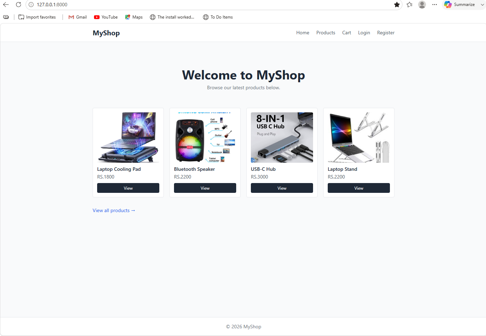
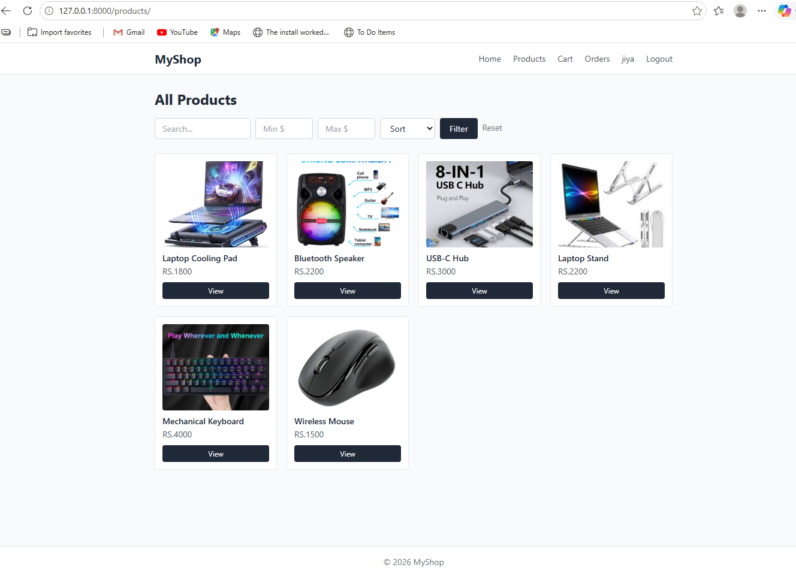
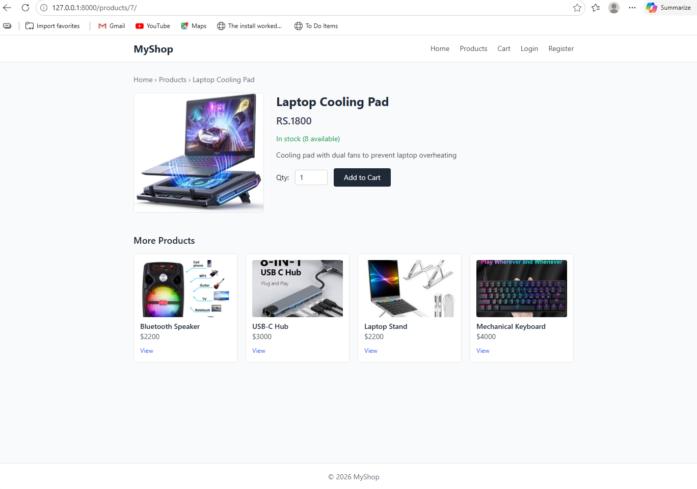
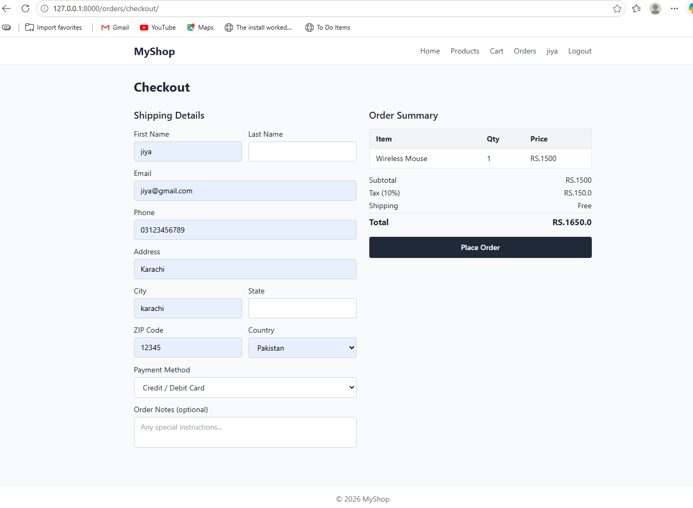
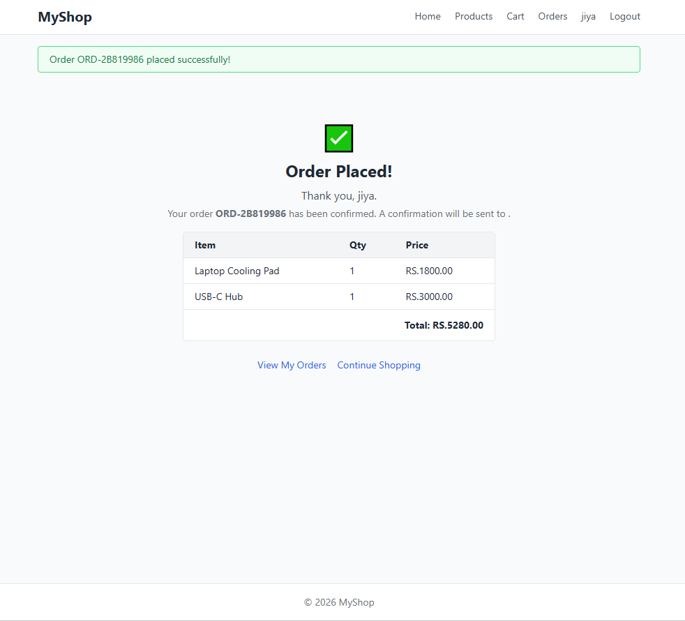
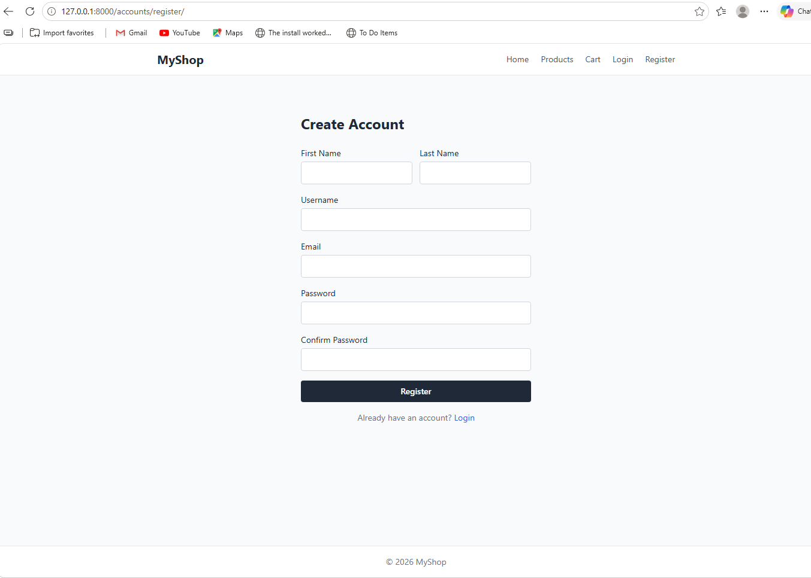
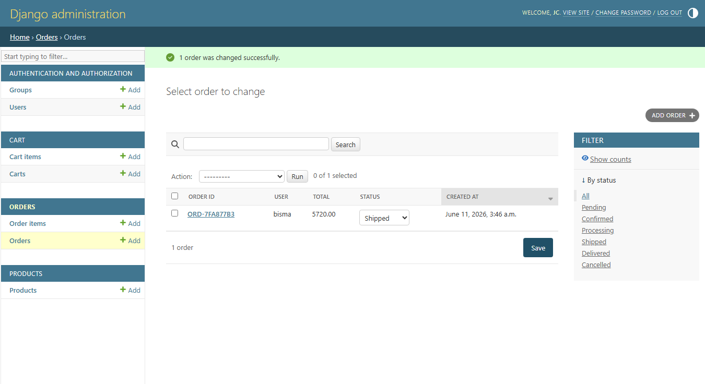
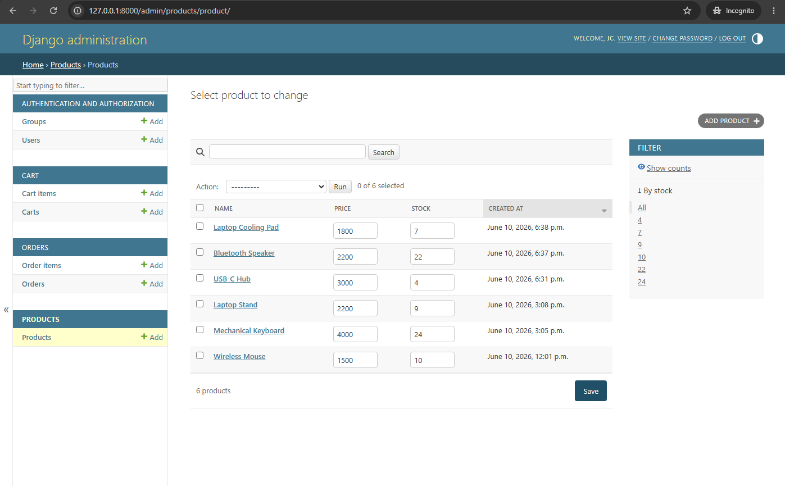

# 🛒 Basic Store – Django E-Commerce Application

A Django-based e-commerce web application that allows users to browse products, manage their shopping cart, and place orders. The application includes user authentication, product management, cart functionality, and order tracking with an admin dashboard for managing products and customer orders.

---

## 🚀 Features

### 👤 Customer Features

* User registration, login, and logout
* Browse all products
* View product details
* Add products to cart
* Remove products from cart
* Cart subtotal, tax, shipping, and order total calculation
* Place orders from the cart
* View order history
* View order details and status

### 🛠️ Admin Features

* Add, update, and delete products
* Manage product inventory and stock
* View all customer orders
* Update order status:

  * Pending
  * Confirmed
  * Processing
  * Shipped
  * Delivered
  * Cancelled
* Manage users and site data through Django Admin

---

## 📦 Order Workflow

```text
Pending → Confirmed → Processing → Shipped → Delivered
```

Orders can also be marked as **Cancelled** when required.

---

## 🧩 Tech Stack

* Backend: Django (Python)
* Database: SQLite
* Frontend: Django Templates (HTML)
* Styling: Tailwind CSS
* Authentication: Django Authentication System

---

## ⚙️ Installation & Setup

```bash
git clone https://github.com/your-username/basic-store.git
cd basic-store

python -m venv venv
venv\Scripts\activate

pip install -r requirements.txt

python manage.py migrate
python manage.py createsuperuser
python manage.py runserver
```

Open your browser and visit:

```text
http://127.0.0.1:8000/
```

Admin panel:

```text
http://127.0.0.1:8000/admin/
```

---

## 📁 Main Modules

* Accounts
* Products
* Cart
* Orders
* Admin Dashboard

---

## 📸 Screenshots

### 🏠 Home Page


### 🛍️ All Products


### 📦 Product Detail


### 💳 Checkout Page


### ✅ Order Placed


### 👤 User Registration


### 📋 Admin – Order Management


### 🛠️ Admin – Product Management
